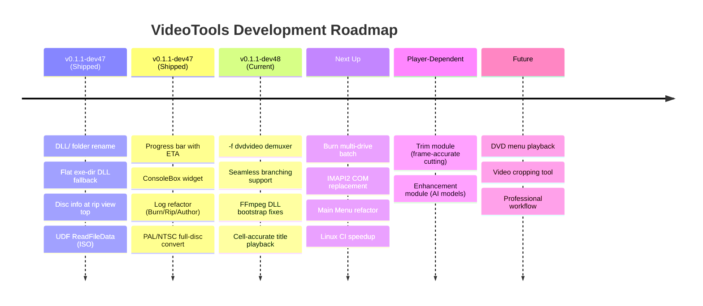

# VideoTools Roadmap

A lightweight forward look. Updated at the start of each dev cycle.

**Interactive board:** open [`roadmap.html`](roadmap.html) in your browser — column-per-module, colour-coded cards, click any card for full details (key files, dependencies, related docs).

## Legend

| Colour | Meaning |
|--------|---------|
| Blue | Shipped in dev47 |
| Green | Current dev48 work |
| Yellow | Next up (handoff priorities) |
| Orange | Blocked on player completion |
| Red | Future / deferred |

## Current State (v0.1.1-dev48)

- Core modules shipped: Convert, Merge, Filters, Audio, Thumb, Inspect, Compare, Rip, Author, Burn, Queue, Settings, Subtitles, Upscale, Enhancement (placeholder).
- Native Go DVD authoring engine with full M1-M7 menu system.
- Native media player: CGo/FFmpeg engine, InlineVideoPlayer API layer, D3D11VA, audio sync, thread-safe.
- Disc ripping: IFO scanning, ISO via UDF reader, region detection, progress with ETA.
- **Seamless branching**: `-f dvdvideo` demuxer now used for single-title rips (FFmpeg 8.1+).
- **DLL bootstrap**: `DLL/` folder with flat exe-dir fallback — no more DLL errors on extraction.
- Burn module: isoburn.exe (Windows), growisofs (Linux), ConsoleBox log, drive info.
- Module Pipeline (&&): two-module chain state machine with queue integration.
- PAL→NTSC / NTSC→PAL full-disc conversion with IFO regeneration.
- Localization: en-CA, fr-CA, Inuktitut (syllabics + Latin, machine-translated).
- CI green on Linux + Windows with from-source FFmpeg static builds.

## Now (dev48 focus)

- **Burn multi-drive batch** — Queue multiple ISOs across available burners.
  See `docs/BURN_MODULE_DESIGN.md` §Phase 2.

- **IMAPI2 COM** — Replace isoburn.exe on Windows for proper progress callbacks.
  See `docs/BURN_MODULE_DESIGN.md` §Phase 3.

- **Main Menu refactor** — Extract `showMainMenu()` from root `mainmenu_module.go` into `internal/app/modules/mainmenu/`.

- **Linux CI speedup** — Pre-built container image for FFmpeg build dependencies.

## Next

- **Enhancement module** — DEPENDS ON PLAYER
  - Open-source AI model integration (BasicVSR, RIFE, RealCUGan)
  - Model registry for easy addition
  - Content-aware model selection

- **Trim module** — DEPENDS ON PLAYER
  - Frame-accurate trimming and cutting
  - Visual timeline with chapter markers
  - Preview-based frame selection

- **Professional workflow**
  - Seamless module chaining (Player ↔ Enhancement ↔ Trim)
  - Batch processing through queue
  - Hardware-accelerated enhancement pipeline

## Localization

See `docs/localization-policy.md` for the full policy.

- en-CA and fr-CA maintained and complete.
- Inuktitut (syllabics + Latin) machine-generated, needs human review.
- All user-facing strings use `i18n.T().KeyName`.

## Versioning

Continuous global `dev` counter, not reset per public version.

Examples:
- `v0.1.1-dev55`
- `v0.1.4-dev72`

Public releases use the base version only (e.g. `v0.1.2`).

## Public Version Bump Policy

Minimum gate for `v0.1.1-devN` → `v0.1.2`:
- Windows and Linux package workflows green on release candidate.
- Full module smoke test pass per `docs/TESTING_MODULE_CHECKLIST.md`.
- No known P0/P1 regressions in conversion, queue, or subtitle sync.
- Changelog complete and matches release scope.
- Deferred items documented in `TODO.md` with explicit carry-over.
