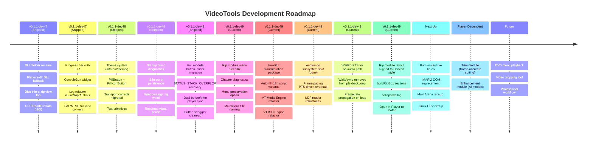

# VideoTools Roadmap

A lightweight forward look. Updated at the start of each dev cycle.

**Interactive board:** open [`roadmap.html`](roadmap.html) in your browser — column-per-module, colour-coded cards, click any card for full details (key files, dependencies, related docs).

## Legend

| Colour | Meaning |
|--------|---------|
| Blue | Shipped in dev47 |
| Teal | Shipped in dev48 |
| **Green** | **Current dev49 work** |
| Yellow | Next up (handoff priorities) |
| Orange | Blocked on player completion |
| Red | Future / deferred |

> **Status distinction:** The interactive board (`roadmap.html`) uses 5 statuses:
> `Shipped` → `Done (Untested)` → `In Progress` → `Planned` → `Deferred`.
> "Done" items are complete and committed but not yet verified by a tester.

## Current State (v0.1.1-dev49)

- Core modules shipped: Convert, Merge, Filters, Audio, Thumb, Inspect, Compare, Rip, Author, Burn, Queue, Settings, Subtitles, Upscale, Enhancement (placeholder).
- Native Go DVD authoring engine with full M1-M7 menu system.
- Native media player: CGo/FFmpeg engine, InlineVideoPlayer API layer, D3D11VA, audio sync, thread-safe.
- Disc ripping: IFO scanning, ISO via UDF reader, region detection, progress with ETA.
- Theme system, PillButton/PillIconButton, text primitives, VTTheme — all button+slider migrations shipped in dev48.
- STATUS_STACK_OVERFLOW recovery, dual before/after player sync shipped in dev48.
- **dev49 focuses on VT Media Engine and VT ISO Engine production-readiness + Rip module fixes + Inuktitut transliteration** — breaking monoliths into subsystem files, fixing menu VOB bleed and chapter embedding, adding menu preservation and main/extra title naming, auto-filling empty i18n script variants via iutools transliteration.
- PAL/NTSC full-disc conversion with IFO regeneration.
- Localization: en-CA, fr-CA, Inuktitut (syllabics + Latin, machine-translated).
- CI green on Linux + Windows with from-source FFmpeg static builds.

## Now (dev49 focus)

- **Rip module menu VOB bleed fixed** — `CollectVOBSets` excludes `VTS_XX_0.VOB` from content sets; chapter timestamps no longer shifted by menu duration.
- **Rip chapter diagnostics** — Verbose logging of chapter count, timestamps, and embedding decisions.
- **Rip menu preservation** — New `IncludeMenus` config + checkbox; menu VOBs export as separate files.
- **Rip main/extra naming** — Main feature (longest title) gets main output path; extras get `_Extra_Title_NN` suffix.
- **Inuktitut transliteration** — `internal/i18n/translit/` package with iutools algorithm for syllabics↔roman conversion; auto-fills empty i18n fields via `translitFill()` in `SetLanguageWithScript`.
- **VT Media Engine engine.go split** — Break 3245-line Engine monolith: hwdecode.go, playback.go, errors.go, framepool.go, subtitle_engine.go, buffer.go.
- **VT ISO Engine UDF reader robustness** — Fallback AVDP scanning, format validation, multi-extent files, ISO 9660 bridge.
- **view.go component split** — Break 1438-line VideoPlayer widget: control_overlay.go, keyboard_shortcuts.go, thumbnail_preview.go.
- **Player interface** — Extract formal Go `Player` interface from `InlineVideoPlayer` for mock testing.
- **HW decode default-on** — Re-evaluate D3D11VA default with VEH/SEH bridge coverage; add per-codec HW blacklist.
- **Thread safety formalisation** — Document lock hierarchy, add lockdep assertions, eliminate reverse-order paths.
- **UDF thread safety & progress** — Mutex-guarded Reader, extraction progress callbacks, temp file cleanup.

## Remaining dev49 work

- **Burn multi-drive batch** — Queue multiple ISOs across available burners.
  See `docs/BURN_MODULE_DESIGN.md` §Phase 2.

- **IMAPI2 COM** — Replace isoburn.exe on Windows for proper progress callbacks.
  See `docs/BURN_MODULE_DESIGN.md` §Phase 3.

- **Main Menu refactor** — Extract `showMainMenu()` from root `mainmenu_module.go` into `internal/app/modules/mainmenu/`.

- **Linux CI speedup** — Pre-built container image for FFmpeg build dependencies.

## Next

- **Enhancement module** — DEPENDS ON PLAYER
  - Open-source AI model integration (BasicVSR, RIFE, RealCUGan)
  - Model registry for easy addition
  - Content-aware model selection

- **Trim module** — DEPENDS ON PLAYER
  - Frame-accurate trimming and cutting
  - Visual timeline with chapter markers
  - Preview-based frame selection

- **Professional workflow**
  - Seamless module chaining (Player ↔ Enhancement ↔ Trim)
  - Batch processing through queue
  - Hardware-accelerated enhancement pipeline

## Localization

See `docs/localization-policy.md` for the full policy.

- en-CA and fr-CA maintained and complete.
- Inuktitut (syllabics + Latin) machine-generated, needs human review.
- All user-facing strings use `i18n.T().KeyName`.

## Versioning

Continuous global `dev` counter, not reset per public version.

Examples:
- `v0.1.1-dev55`
- `v0.1.4-dev72`

Public releases use the base version only (e.g. `v0.1.2`).

## Public Version Bump Policy

Minimum gate for `v0.1.1-devN` → `v0.1.2`:
- Windows and Linux package workflows green on release candidate.
- Full module smoke test pass per `docs/TESTING_MODULE_CHECKLIST.md`.
- No known P0/P1 regressions in conversion, queue, or subtitle sync.
- Changelog complete and matches release scope.
- Deferred items documented in `TODO.md` with explicit carry-over.
