# VideoTools Roadmap

A lightweight forward look. Updated at the start of each dev cycle.

**Interactive board:** open [`roadmap.html`](roadmap.html) in your browser — column-per-module, colour-coded cards, click any card for full details (key files, dependencies, related docs).

```mermaid
timeline
    title VideoTools Development Roadmap
    v0.1.1-dev47 (Shipped) : DLL/ folder rename : Flat exe-dir DLL fallback : Disc info at rip view top : UDF ReadFileData (ISO)
    v0.1.1-dev47 (Shipped) : Progress bar with ETA : ConsoleBox widget : Log refactor (Burn/Rip/Author) : PAL/NTSC full-disc convert
    v0.1.1-dev48 (Shipped) : Theme system (internal/theme/) : PillButton + PillIconButton : Transport controls migrated : Text primitives
    v0.1.1-dev48 (Shipped) : Startup crash diagnostics : i18n script persistence : Windows signing wired : Roadmap visual polish
    v0.1.1-dev48 (Shipped) : Full module button+slider migration : STATUS_STACK_OVERFLOW recovery : Dual before/after player sync : Button straggler clean-up
    v0.1.1-dev49 (Shipped) : Rip module menu bleed fix : Chapter diagnostics : Menu preservation option : Main/extra title naming
    v0.1.1-dev49 (Shipped) : Inuktitut transliteration package : Auto-fill i18n script variants : VT Media Engine refactor
    v0.1.1-dev49 (Shipped) : engine.go subsystem split : Frame pacing PTS-driven overhaul : bwdif deinterlace (libavfilter)
    v0.1.1-dev49 (Shipped) : WaitForPTS for no-audio path : WaitVsync removed from playbackLoop : Frame rate propagation on load
    v0.1.1-dev49 (Shipped) : Rip module layout aligned to Convert style : buildRipBox sections : collapsible log : Open in Player to footer
    v0.1.1-dev49 (Shipped) : Rip source rework : disc info in Source section : single ... browse button : format validation
    v0.1.1-dev49 (Shipped) : Player idle aspect ratio setting : 4:3/16:9/5:3/21:9/9:16 SMPTE bars
    v0.1.1-dev49 (Shipped) : C disc debug utility (hex dump, dir listing, stat)
    v0.1.1-dev49 (Shipped) : Seek corruption fix (accurate fallback) : Player singleton consolidation (10→2) : Verbose seek logging : Media Engine architecture doc
    v0.1.1-dev49 (Shipped) : Thread safety formalisation (lock hierarchy, lockdep, named helpers)
    v0.1.1-dev49 (Shipped) : NoInheritHandles Windows subprocess (file-in-use fix) : Queue.Stop cancels running job (zombie FFmpeg fix)
    v0.1.1-dev49 (Shipped) : Windows Job Object KILL_ON_JOB_CLOSE (crash-safe FFmpeg cleanup) : Linux Pdeathsig SIGKILL on all subprocesses
    v0.1.1-dev49 (Shipped) : Dropdown active item text colour fix (ForegroundOnPrimary on VT_Green)
    v0.1.1-dev50 (Current) : Player error recovery overhaul : HW decode default-on evaluation : Frame cache memory bounds
    v0.1.1-dev50 (Current) : P1-1 Network streaming (Engine.OpenURL, LoadURL) : P1-2 Resume/watch-later : P1-3 A/V Offset (audio delay)
    v0.1.1-dev50 (Current) : P1-4 Speed+pitch correction (atempo filter) : P1-6 SeekAccuracy Settings UI : P1-9 Player Tuning (HW decode → Player card)
    v0.1.1-dev50 (Current) : P1-10 Growing-file support (poll + reload on growth) : P1-7 Bilinear scaling (SWS_BICUBIC confirmed, docs only)
    v0.1.1-dev50 (Current) : view.go component split (control_overlay, keyboard_shortcuts, thumbnail_preview) : Player interface extraction
    v0.1.1-dev50 (Current) : ASS subtitle format bugs (formatASSTime centisecs, escapeASSText double-escape)
    v0.1.1-dev50 (Current) : UDF reader robustness (fallback AVDP, multi-extent, ISO 9660 bridge)
    v0.1.1-dev50 (Current) : Burn multi-drive batch : IMAPI2 COM replacement : Main Menu refactor : Linux CI speedup
    Player-Dependent : Trim module (frame-accurate cutting) : Enhancement module (AI models)
    Future : DVD menu playback : Video cropping tool : Professional workflow
```

## Legend

| Colour | Meaning |
|--------|---------|
| Blue | Shipped in dev47 |
| Teal | Shipped in dev48 |
| Purple | Shipped in dev49 |
| **Green** | **Current dev50 work** |
| Yellow | Next up (handoff priorities) |
| Orange | Blocked on player completion |
| Red | Future / deferred |

> **Status distinction:** The interactive board (`roadmap.html`) uses 5 statuses:
> `Shipped` → `Done (Untested)` → `In Progress` → `Planned` → `Deferred`.
> "Done" items are complete and committed but not yet verified by a tester.

## Current State (v0.1.1-dev50)

- Core modules shipped: Convert, Merge, Filters, Audio, Thumb, Inspect, Compare, Rip, Author, Burn, Queue, Settings, Subtitles, Upscale, Enhancement (placeholder).
- Native Go DVD authoring engine with full M1-M7 menu system.
- Native media player: CGo/FFmpeg engine, InlineVideoPlayer API layer, D3D11VA, audio sync, thread-safe, bwdif deinterlace, PTS-driven frame timing.
- Disc ripping: IFO scanning, ISO via UDF reader, region detection, progress with ETA, menu preservation, main/extra naming.
- Theme system, PillButton/PillIconButton, text primitives, VTTheme, collapsible section headers — all migrations shipped.
- Process management: Windows Job Object (crash-safe FFmpeg cleanup), Linux Pdeathsig, NoInheritHandles, Queue.Stop cancellation.
- PAL/NTSC full-disc conversion with IFO regeneration.
- Localization: en-CA, fr-CA, Inuktitut (syllabics + Latin, machine-translated + auto-translit).
- CI green on Linux + Windows with from-source FFmpeg static builds.
- **dev50 focuses on player stability (error recovery, HW decode evaluation, frame bounds), view.go split, ASS subtitle fixes, UDF hardening.**

## Now (dev50 focus)

- **Phase 0 complete** — All five P0 critical fixes shipped: error ring buffer (P0-4), HW→SW degradation (P0-1), NextFrame hang (P0-2), backward step (P0-3), OpenAuto disc fallback (P0-5). Per-codec HW blacklist and platform `AudioBufferLatency` deferred to Phase 3.
- **P1-1: Network/URL streaming shipped** — `Engine.OpenURL(url, opts)` with AVDictionary defaults (60s timeout, reconnect). `InlineVideoPlayer.LoadURL()` exposed. Supports HTTP/HTTPS/HLS/DASH/RTSP/RTMP.
- **P1-2: Resume/watch-later shipped** — `InlineVideoPlayer` auto-saves position every 5s during playback, restores on load, marks completed on EOF. Shared `ResumeState` wired to both player singletons via `initNativeMediaAssets`.
- **P1-3: Audio delay shipped** — `Engine.audioDelayBits` (atomic); `WaitForPTS(pts + avDelay)` in NextFrame audio path. Settings → Player "A/V Offset (ms)" entry, persists in `PrefsConfig.AVOffset`. `setPlayerAVOffset()` applies mid-session.
- **P1-4: Speed + pitch correction shipped** — `AudioFilterGraph.Process()` implemented with `vt_atempo_process` C helper (AVFrame push/drain through atempo filter graph). `AudioPlayer.filterGraph` lazy-initialized in `SetSpeed()`. `Read()` routes chunks through atempo; leftover path skips re-processing when filter is active.
- **P1-6 + P1-9: Settings Player tab shipped** — SeekAccuracy dropdown (Fast/Fastest/Precise), HW decode section moved from Hardware card to Player card. `PrefsConfig.SeekAccuracy` persisted. `setPlayerSeekAccuracy()` applies mid-session.
- **P1-7: Bilinear scaling shipped (docs-only)** — `sws_scale` at `engine.go:1445` and `framepool.go:36` confirmed using `SWS_BICUBIC`. The `scaleNearest` docstring in `view.go:833` now clarifies that the FFmpeg swscale pipeline (not the canvas blit) determines visual quality.
- **P1-10: Growing-file support shipped** — `InlineVideoPlayer.growingFileWatcher()` polls file size every 2s on EOF. When size grows, re-opens via `Load()`, seeks to last position, resumes playback. Toggle via `SetGrowingFile(bool)` on Engine, wired through InlineVideoPlayer.
- **HW decode default-on evaluation** — Re-evaluate D3D11VA default with VEH/SEH bridge and `STATUS_STACK_OVERFLOW` recovery in place; add per-codec HW blacklist for problem codecs.
- **Frame cache memory bounds** — Byte-aware frame pool eviction, memory-pressure callback, pool size distribution logging.
- **view.go component split** — Break 1438-line `VideoPlayer` widget: `control_overlay.go`, `keyboard_shortcuts.go`, `thumbnail_preview.go`.
- **Player interface extraction** — Formal Go `Player` interface from `InlineVideoPlayer` enabling mock-based unit tests.
- **ASS subtitle format bugs** — `formatASSTime` outputs wrong centiseconds format; `escapeASSText` double-escapes closing brace.
- **UDF reader robustness** — Fallback AVDP scanning for non-standard discs; format validation on all descriptors; multi-extent file support; ISO 9660 bridge.

## Remaining dev50 work (carry-forward from dev49)

- **Burn multi-drive batch** — Queue multiple ISOs across available burners.
  See `docs/BURN_MODULE_DESIGN.md` §Phase 2.

- **IMAPI2 COM** — Replace isoburn.exe on Windows for proper progress callbacks.
  See `docs/BURN_MODULE_DESIGN.md` §Phase 3.

- **Main Menu refactor** — Extract `showMainMenu()` from root `mainmenu_module.go` into `internal/app/modules/mainmenu/`.

- **Linux CI speedup** — Pre-built container image for FFmpeg build dependencies.

## Next

- **Enhancement module** — DEPENDS ON PLAYER
  - Open-source AI model integration (BasicVSR, RIFE, RealCUGan)
  - Model registry for easy addition
  - Content-aware model selection

- **Trim module** — DEPENDS ON PLAYER
  - Frame-accurate trimming and cutting
  - Visual timeline with chapter markers
  - Preview-based frame selection

- **Professional workflow**
  - Seamless module chaining (Player ↔ Enhancement ↔ Trim)
  - Batch processing through queue
  - Hardware-accelerated enhancement pipeline

## Localization

See `docs/localization-policy.md` for the full policy.

- en-CA and fr-CA maintained and complete.
- Inuktitut (syllabics + Latin) machine-generated, needs human review.
- All user-facing strings use `i18n.T().KeyName`.

## Versioning

Continuous global `dev` counter, not reset per public version.

Examples:
- `v0.1.1-dev55`
- `v0.1.4-dev72`

Public releases use the base version only (e.g. `v0.1.2`).

## Public Version Bump Policy

Minimum gate for `v0.1.1-devN` → `v0.1.2`:
- Windows and Linux package workflows green on release candidate.
- Full module smoke test pass per `docs/TESTING_MODULE_CHECKLIST.md`.
- No known P0/P1 regressions in conversion, queue, or subtitle sync.
- Changelog complete and matches release scope.
- Deferred items documented in `TODO.md` with explicit carry-over.
