# VideoTools Roadmap

A lightweight forward look. Updated at the start of each dev cycle.

**Interactive board:** open [`roadmap.html`](roadmap.html) in your browser — column-per-module, colour-coded cards, click any card for full details (key files, dependencies, related docs).

```mermaid
timeline
    title VideoTools Development Roadmap
    v0.1.1-dev47 (Shipped) : DLL/ folder rename : Flat exe-dir DLL fallback : Disc info at rip view top : UDF ReadFileData (ISO)
    v0.1.1-dev47 (Shipped) : Progress bar with ETA : ConsoleBox widget : Log refactor (Burn/Rip/Author) : PAL/NTSC full-disc convert
    v0.1.1-dev48 (Shipped) : Theme system (internal/theme/) : PillButton + PillIconButton : Transport controls migrated : Text primitives
    v0.1.1-dev48 (Shipped) : Startup crash diagnostics : i18n script persistence : Windows signing wired : Roadmap visual polish
    v0.1.1-dev48 (Shipped) : Full module button+slider migration : STATUS_STACK_OVERFLOW recovery : Dual before/after player sync : Button straggler clean-up
    v0.1.1-dev49 (Shipped) : Rip module menu bleed fix : Chapter diagnostics : Menu preservation option : Main/extra title naming
    v0.1.1-dev49 (Shipped) : Inuktitut transliteration package : Auto-fill i18n script variants : VT Media Engine refactor
    v0.1.1-dev49 (Shipped) : engine.go subsystem split : Frame pacing PTS-driven overhaul : bwdif deinterlace (libavfilter)
    v0.1.1-dev49 (Shipped) : WaitForPTS for no-audio path : WaitVsync removed from playbackLoop : Frame rate propagation on load
    v0.1.1-dev49 (Shipped) : Rip module layout aligned to Convert style : buildRipBox sections : collapsible log : Open in Player to footer
    v0.1.1-dev49 (Shipped) : Rip source rework : disc info in Source section : single ... browse button : format validation
    v0.1.1-dev49 (Shipped) : Player idle aspect ratio setting : 4:3/16:9/5:3/21:9/9:16 SMPTE bars
    v0.1.1-dev49 (Shipped) : C disc debug utility (hex dump, dir listing, stat)
    v0.1.1-dev49 (Shipped) : Seek corruption fix (accurate fallback) : Player singleton consolidation (10→2) : Verbose seek logging : Media Engine architecture doc
    v0.1.1-dev49 (Shipped) : Thread safety formalisation (lock hierarchy, lockdep, named helpers)
    v0.1.1-dev49 (Shipped) : NoInheritHandles Windows subprocess (file-in-use fix) : Queue.Stop cancels running job (zombie FFmpeg fix)
    v0.1.1-dev49 (Shipped) : Windows Job Object KILL_ON_JOB_CLOSE (crash-safe FFmpeg cleanup) : Linux Pdeathsig SIGKILL on all subprocesses
    v0.1.1-dev49 (Shipped) : Dropdown active item text colour fix (ForegroundOnPrimary on VT_Green)
    v0.1.1-dev50 (Shipped) : Player error recovery overhaul : HW decode default-on evaluation : HDR tone-mapping : Playlist / sequential play
    v0.1.1-dev50 (Shipped) : Network streaming (Engine.OpenURL) : Resume/watch-later : A/V Offset : Speed+pitch correction
    v0.1.1-dev50 (Shipped) : SeekAccuracy UI : Player Tuning : Growing-file support : Clock drift correction : A-B loop : Frame timing overlay
    v0.1.1-dev50 (Shipped) : ASS subtitle fixes : HW decode default-on : Error concealment last-good-frame
    v0.1.1-dev50 (Shipped) : UDF reader robustness (ShortAd, partition offset, multi-extent)
    v0.1.1-dev50 (Shipped) : Collapsible player panel (all 5 modules) : Logging Windows clear fix : version in header : Updater sidecar : CI DLL cache : DLL validation
    v0.1.1-dev51 (Current) : P0 error/loading/buffering overlay indicators wired
    v0.1.1-dev51 (Current) : P2 stub method-set divergence fixed : dead fields/callbacks removed : cosmetic fullscreen/PiP buttons removed : CC button wired : orphaned GPU package removed
    v0.1.1-dev51 (Current) : P1 view.go component split (5 focused files) : UDF thread safety & progress callbacks
    v0.1.1-dev51 (Current) : Legacy singleton alias vars removed (10 per-module vars → GetXxxPlayer() getters)
    Player-Dependent : Trim module (frame-accurate cutting) : Enhancement module (AI models)
    Future : DVD menu playback : Video cropping tool : Professional workflow
```

## Legend

| Colour | Meaning |
|--------|---------|
| Blue | Shipped in dev47 |
| Teal | Shipped in dev48 |
| Purple | Shipped in dev49 |
| **Green** | **Current dev51 work** |
| Yellow | Next up (handoff priorities) |
| Orange | Blocked on player completion |
| Red | Future / deferred |

> **Status distinction:** The interactive board (`roadmap.html`) uses 5 statuses:
> `Shipped` → `Done (Untested)` → `In Progress` → `Planned` → `Deferred`.
> "Done" items are complete and committed but not yet verified by a tester.

## Current State (v0.1.1-dev51)

- All dev50 items shipped, including the full Phase 0+1 media engine gap closure.
- **Dev51 shipped**: P0 error/loading/buffering overlay indicators, P2 player cleanup (stub divergence, dead fields, fullscreen/PiP buttons, CC wiring, orphaned GPU remove), P1 view.go component split + UDF thread safety, legacy singleton alias vars removed.
- Engine-level bwdif deinterlace (libavfilter, Settings toggle default on).
- Player singleton consolidation (10→2 shared instances); per-module getters retained as wrappers.
- Thread safety formalisation (lock hierarchy, lockdep, named helpers).
- Rip module: menu VOB bleed fix, chapter diagnostics, menu preservation, main/extra naming.
- Theme system, PillButton/PillIconButton, text primitives, collapsible section headers — all migrations shipped.
- All 11 Phase 1 items shipped. Phase 2 deferred.

## Now (dev52 — open)

- **CI & infra hardening shipped** — all four Windows pipelines green; three static binaries; release protocol codified
- Next: renderDualPlayerPreview design, dead-code retirement, documentation pass

## Shipped (dev51)

- **GitHub Actions CI green (both platforms)** — Windows build fixed (MSYS2 shell, GOROOT, CC via cygpath, pkg-config with loud failure, crypt32/ncrypt)
- **Windows: three fully static binaries** — static ffmpeg.exe/ffprobe.exe sidecars, DLL/ folder retired, objdump dependency gates in CI (settled decision)
- **v0.1.1-dev51 release published** — first release from the GitHub Actions pipeline
- **P0 indicators wired** — loading spinner, buffering label, error indicator now render over video
- **P2 cleanup** — Stub divergence fixed, dead fields removed, fullscreen/PiP buttons removed, CC button wired to subtitle engine, orphaned GPU package deleted
- **P1 view.go split** — 1442-line monolith → 5 focused files
- **UDF thread safety** — mutex-guarded partitionStart, progress callbacks, deferred cleanup
- **Legacy alias vars removed** — 10 per-module vars cleaned from native_media.go
- **Carry-forward deferred**: Player interface extraction, renderDualPlayerPreview stub, Burn multi-drive batch, IMAPI2 COM, Main Menu refactor, Linux CI speedup, UDF 2.50/2.60 + BDMV, UDF sparse writer

## Next (Phase 2)

- **Enhancement module** — DEPENDS ON PLAYER
- **Trim module** — DEPENDS ON PLAYER
- **Professional workflow** — Module chaining, batch processing
- **Deferred carry-forward**: Player interface extraction, Burn multi-drive batch, IMAPI2 COM, Main Menu refactor, Linux CI speedup, UDF 2.50/2.60 + BDMV, UDF sparse writer

## Localization

See `docs/localization-policy.md` for the full policy.

- en-CA and fr-CA maintained and complete.
- Inuktitut (syllabics + Latin) machine-generated, needs human review.
- All user-facing strings use `i18n.T().KeyName`.

## Versioning

Continuous global `dev` counter, not reset per public version.

Examples:
- `v0.1.1-dev55`
- `v0.1.4-dev72`

Public releases use the base version only (e.g. `v0.1.2`).

## Public Version Bump Policy

Minimum gate for `v0.1.1-devN` → `v0.1.2`:
- Windows and Linux package workflows green on release candidate.
- Full module smoke test pass per `docs/TESTING_MODULE_CHECKLIST.md`.
- No known P0/P1 regressions in conversion, queue, or subtitle sync.
- Changelog complete and matches release scope.
- Deferred items documented in `TODO.md` with explicit carry-over.
