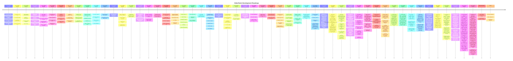

# VideoTools Roadmap

A lightweight forward look. Updated at the start of each dev cycle.

**Interactive board:** open [`roadmap.html`](roadmap.html) in your browser — column-per-module, colour-coded cards, click any card for full details (key files, dependencies, related docs).

```mermaid
timeline
    title VideoTools Development Roadmap
    v0.1.1-dev47 (Shipped) : DLL/ folder rename : Flat exe-dir DLL fallback : Disc info at rip view top : UDF ReadFileData (ISO)
    v0.1.1-dev47 (Shipped) : Progress bar with ETA : ConsoleBox widget : Log refactor (Burn/Rip/Author) : PAL/NTSC full-disc convert
    v0.1.1-dev48 (Shipped) : Theme system (internal/theme/) : PillButton + PillIconButton : Transport controls migrated : Text primitives
    v0.1.1-dev48 (Shipped) : Startup crash diagnostics : i18n script persistence : Windows signing wired : Roadmap visual polish
    v0.1.1-dev48 (Shipped) : Full module button+slider migration : STATUS_STACK_OVERFLOW recovery : Dual before/after player sync : Button straggler clean-up
    v0.1.1-dev49 (Shipped) : Rip module menu bleed fix : Chapter diagnostics : Menu preservation option : Main/extra title naming
    v0.1.1-dev49 (Shipped) : Inuktitut transliteration package : Auto-fill i18n script variants : VT Media Engine refactor
    v0.1.1-dev49 (Shipped) : engine.go subsystem split : Frame pacing PTS-driven overhaul : bwdif deinterlace (libavfilter)
    v0.1.1-dev49 (Shipped) : WaitForPTS for no-audio path : WaitVsync removed from playbackLoop : Frame rate propagation on load
    v0.1.1-dev49 (Shipped) : Rip module layout aligned to Convert style : buildRipBox sections : collapsible log : Open in Player to footer
    v0.1.1-dev49 (Shipped) : Rip source rework : disc info in Source section : single ... browse button : format validation
    v0.1.1-dev49 (Shipped) : Player idle aspect ratio setting : 4:3/16:9/5:3/21:9/9:16 SMPTE bars
    v0.1.1-dev49 (Shipped) : C disc debug utility (hex dump, dir listing, stat)
    v0.1.1-dev49 (Shipped) : Seek corruption fix (accurate fallback) : Player singleton consolidation (10→2) : Verbose seek logging : Media Engine architecture doc
    v0.1.1-dev49 (Shipped) : Thread safety formalisation (lock hierarchy, lockdep, named helpers)
    v0.1.1-dev49 (Shipped) : NoInheritHandles Windows subprocess (file-in-use fix) : Queue.Stop cancels running job (zombie FFmpeg fix)
    v0.1.1-dev49 (Shipped) : Windows Job Object KILL_ON_JOB_CLOSE (crash-safe FFmpeg cleanup) : Linux Pdeathsig SIGKILL on all subprocesses
    v0.1.1-dev49 (Shipped) : Dropdown active item text colour fix (ForegroundOnPrimary on VT_Green)
    v0.1.1-dev50 (Shipped) : Player error recovery overhaul : HW decode default-on evaluation : HDR tone-mapping : Playlist / sequential play
    v0.1.1-dev50 (Shipped) : Network streaming (Engine.OpenURL) : Resume/watch-later : A/V Offset : Speed+pitch correction
    v0.1.1-dev50 (Shipped) : SeekAccuracy UI : Player Tuning : Growing-file support : Clock drift correction : A-B loop : Frame timing overlay
    v0.1.1-dev50 (Shipped) : ASS subtitle fixes : HW decode default-on : Error concealment last-good-frame
    v0.1.1-dev50 (Shipped) : UDF reader robustness (ShortAd, partition offset, multi-extent)
    v0.1.1-dev50 (Shipped) : Collapsible player panel (all 5 modules) : Logging Windows clear fix : version in header : Updater sidecar : CI DLL cache : DLL validation
    v0.1.1-dev51 (Current) : P0 error/loading/buffering overlay indicators wired
    v0.1.1-dev51 (Current) : P2 stub method-set divergence fixed : dead fields/callbacks removed : cosmetic fullscreen/PiP buttons removed : CC button wired : orphaned GPU package removed
    v0.1.1-dev51 (Current) : P1 view.go component split (5 focused files) : UDF thread safety & progress callbacks
    v0.1.1-dev51 (Current) : Legacy singleton alias vars removed (10 per-module vars → GetXxxPlayer() getters)
    v0.1.1-dev52 (Shipped) : CI & infra hardening : Three static binaries : Update checker migrated to GitHub API
    v0.1.1-dev53 (Shipped) : Update checker migrated from Forgejo to GitHub API
    v0.1.1-dev54 (Shipped) : Player performance fixes (6 bottlenecks) : Convert layout state persistence
    v0.1.1-dev55 (Shipped) : seekGen log spam crash fix : Convert layout fixes : Resume crash fix : VLC backend decision : Player minimize → metadata full column
    v0.1.1-dev56 (Shipped) : NTSC/PAL video standard detection : CI FFmpeg build fix (.tar.xz → .tar.bz2) : Content browser build fixes : dvdvideo detection string fixed (CI grep + runtime probe)
    v0.1.1-dev57 (Shipped) : Release cut after dvdvideo detection fixes : dvdvideo→VOB concat runtime fallback : dvdread.pc fail-fast guard
    v0.1.1-dev58 (Shipped) : Rip module overhaul (linear workflow, DiscSummary, Advanced accordion, readiness line, i18n pass)
    v0.1.1-dev59 (Superseded) : Blocked-straggler cleanup : Rip view crash fix : Codeberg mirror retired : CI FFmpeg build resilience — tagged but release never published (release job skipped after windows cold-build flake); content ships as dev60
    v0.1.1-dev60 (Shipped) : Release cut — dev59 content (rip crash fix, Codeberg, cleanup) + CI FFmpeg build resilience (cache restore-keys + download retries). **Published 2026-09-02** (both platform assets); MSIX `Setup static FFmpeg` fixed — missing `export PKG_CONFIG_PATH=/c/ffmpeg-static/lib/pkgconfig` made libdvdnav configure fail on `dvdread`
    v0.1.1-dev61 (Shipped) : **Rip density refinement** — two-column 55/45 workspace (CONTENT | PROCESSING), new ui.SectionBox shared component used by all 8 module helpers (rip + audio/upscale/thumbnail/inspect/compare/filters/trim). **In-app updater fixed** — asset-suffix mismatch (`_windows.zip` vs `_windows_amd64.zip`) had made Install Update always fail; from dev61 onward updates work in-app. Tester screenshots found layout bugs — fixed in dev62
    v0.1.1-dev62 (Shipped) : **Rip layout correction pass** — action-bar Border fix (wrapping-label-in-HBox root cause behind the giant button band, clipped right column, one-char-per-line label) : compact empty states (DiscSummary rows hidden, MenuPreview 40px strip, ContentBrowser centred hint) : first in-app update exercise (dev61→dev62) : published 2026-09-03 (tag v0.1.1-dev62, ccb4f213), all pipelines green
    v0.1.1-dev63 (Shipped) : **dev62 follow-up patches** — Convert/Filters/Upscale metadata-fold fix (tappable METADATA header stays visible, only the body hides) : rip ISO-load scanning-state fix (SetScanning no longer clobbered by rebuildEnrich's SetEmpty) : ISO scan hardening (runISOScan recover→SetError, CatDVD logging, re-scan on module re-entry). **Published 2026-09-04** (tag v0.1.1-dev63, 87a0c6ad)
    v0.1.1-dev64 (Shipped) : **Rip modes + per-language subtitle selection** — mode radio (Selected scenes / Full movie of the longest title) : one subtitle checkbox per main-title language mapped to per-stream -map 0:s:<idx> : scan-as-you-go disc snippets in the DiscSummary : **Convert SMPTE-idle restore** (player reset on menu-driven re-entry) : published 2026-09-06
    v0.1.1-dev65 (Shipped) : **Rip refinement follow-up** — vertical-space layout pass (log demoted to a collapsed strip + menu preview compact until a frame loads, Content Browser regains flexible height) : **Load Disc from an optical drive** (detect → drive picker → VIDEO_TS resolution → normal rip path) : pending tester verification
    v0.1.1-dev66 (Shipped) : **Settings keyboard navigation** (PageUp/PageDown/Home/End scroll the active tab) : **updater error-message hardening** (rate-limit/release-not-published/network causes surfaced in the dialog) : published 2026-09-07 (tag v0.1.1-dev66, ee73323d)
    v0.1.1-dev67 (Shipped) : **Rip de-clutter** (Disc Menu preview + in-app Rip Log removed; Content Browser owns the column) : **rip default mode** ("Full movie (main feature)" first + default) : **settings keyboard-nav fix** (focused key-catcher widget + canvas OnKeyDown fallback — dev66's CustomShortcut never fired for unmodified keys) : published 2026-09-10 (tag v0.1.1-dev67, fc444a78)
    v0.1.1-dev68 (Shipped) : **VOB-concat subtitle-map clamp** — liar-IFO discs (IFO advertises more subtitle languages than the VOBs carry) no longer hard-fail the concat fallback; the executor probes the real subtitle stream count and clamps per-stream -map indices to what exists
    v0.1.1-dev69 (Shipped) : **VOB-concat stale-PTS duration cap** — grey-market discs whose VOBs carry a phantom tail packet at a huge PTS offset inflated fallback rips to "26hrs"; the executor now probes per-VOB durations and caps the output with -t ceil(Σ + 60s) so stray tail packets never land in the MKV
    v0.1.1-dev70 (Shipped) : **Rip UI polish** — mode radio reworded ("Movie + extras (choose titles)" / "Main feature only", stacked vertically) : title-card info line on one localized line ("N chapters · N audio · N subs", no word-wrap split, no duplicated T##/duration) : subtitle-language picker gains Select All / Deselect All buttons
    v0.1.1-dev71 (Shipped) : **VOB-concat stale-PTS cap hardened** (IFO PGC duration sources the cap when per-VOB probes fail or sum to stale hours — dev69 gap closed, verified 1822.816 s not 26hrs) : **Title-driven output filenames** (Title field names the file; source-folder fallback and full-disc naming kept; hand-editing the path stops auto-naming)
    v0.1.1-dev72 (Shipped) : **ISO 9660 fallback for non-UDF disc images** — new native ISO 9660 reader (internal/dvd/iso9660) + UDF→ISO 9660 fallback in scan and rip so images with a broken/dummy UDF bridge (grey-market burns) scan and rip normally; honest combined errors when BOTH filesystems fail — never a false-corrupt label. Published 2026-09-12 (tag v0.1.1-dev72, c0e21121)
    v0.1.1-dev73 (Shipped) : **Per-title PGC duration scan consistency** — multi-PGC VTS discs (scene-segmented titles) report each title's real duration/chapter count instead of reusing the first title-domain PGC for every title; same per-title PGC read threaded into rips for chapters/cap; Red Hairy Teens (2008) 7-title disc verified
    v0.1.1-dev74 (Shipped) : **Scene-segment rip modes + cell-accurate VOB concat** — rip offers a "Scene segments only" mode on scene-segmented discs (longest-run/segment auto-detection, whole-movie titles greyed/locked, segments pre-selected and toggleable) : the VOB-concat fallback now slices VOBs to the selected title's PGC cell byte ranges (correct content for shared-VTS extra titles, not the movie's opening) : loading a new disc no longer leaks the previous movie's Title into the output filename
    v0.1.1-dev75 (Shipped) : **Dynamic rip-mode selection + bulk-selection deadlock fix** — the rip-mode radio now reshapes the title selection to the mode on transition (Movie+extras auto-selects all, Main-feature-only keeps the longest anchored, Scenes-only selects the segments; manual toggles inside a mode persist) : Select All / Deselect All no longer deadlock the UI thread (SetChecked-under-mutex root cause; lock layer is visual-only, selection owned by ReshapeSelection) : a freshly loaded disc resets the mode to Main-feature-only
    v0.1.1-dev76 (Shipped) : **ISO 9660 resolve fix + menu-export dedup + choose-titles starts empty** — the rip resolver demanded a nested `tempDir\VIDEO_TS` folder but the native UDF/ISO 9660 readers extract FLAT (files land in the destination root), so every ISO 9660-only grey-market image failed the rip path ("VIDEO_TS not found in ISO 9660 image") right after a successful scan (`Lewd Conduct 1.iso` + `Barely Legal #11.iso`); `extractedVideoTSPath` now accepts nested or flat. Repeated title rips of one disc no longer write a fresh identical `_Menu_<label>.mkv` per output base (`menuAlreadyExported` skips same-(label,size) menus). dev75's choose-titles reshape auto-selected every title on mode switch → `CanonicalSelection` returns empty for "" mode — what is ticked is exactly what rips. Published 2026-09-14 (tag v0.1.1-dev76, ba864a8e)
    v0.1.1-dev77 (Current) : **Thumbnail native resolution + movie+extras auto-select + drawtext-restored CI FFmpeg** — thumbnail size selects gain "Native (WxH)" (source video's real width); contact-sheet total counter reflects live slider values; the generator probes for drawtext once per run and skips overlays gracefully when the FFmpeg build lacks the filter. On scene-set discs, "Movie + extras (choose titles)" pre-selects the main feature + genuine extras WITHOUT the scene segments (the movie already contains them) and WITHOUT duplicate whole-movie copies; no scene set → still starts empty. CI now builds freetype 2.13.3 static into all Windows FFmpeg sidecars (--enable-libfreetype), restoring drawtext in shipped binaries with a per-build "grep drawtext" gate. Queue completed jobs show just "Status: Completed" (no elapsed suffix). Deps bumped x/image v0.43.0 / x/net v0.55.0 / go 1.26.6 — govulncheck 0 reachable
    Player-Dependent : Trim module (frame-accurate cutting) : Enhancement module (AI models)
    Future : DVD menu playback : Video cropping tool : Professional workflow
```

## Legend

| Colour | Meaning |
|--------|---------|
| Blue | Shipped in dev47 |
| Teal | Shipped in dev48 |
| Purple | Shipped in dev49 |
| **Green** | **Current dev64 work** |
| Yellow | Next up (handoff priorities) |
| Orange | Blocked on player completion |
| Red | Future / deferred |

> **Status distinction:** The interactive board (`roadmap.html`) uses 5 statuses:
> `Shipped` → `Done (Untested)` → `In Progress` → `Planned` → `Deferred`.
> "Done" items are complete and committed but not yet verified by a tester.

## Current State (dev77)

- **Dev77 in progress (tag `v0.1.1-dev77`)**: (1) **Thumbnail native-resolution + overlay resilience** — contact-sheet and individual thumbnail size selects gain a "Native (WxH)" option resolving to the source video's real width (screenshots judged at source resolution); the contact-sheet "Total thumbnails" count now derives from the live columns/rows slider values instead of a stale captured opts struct; and the generator probes once per run for the drawtext filter (`ffmpeg -filters`), degrading to plain output + a debug warning when the static FFmpeg lacks libfreetype/libfontconfig instead of hard-failing "No such filter". (2) **Movie + extras auto-select on scene-set discs** — `CanonicalSelection` now pre-selects the main feature plus genuine extras on a scene-segmented disc, WITHOUT the scene segments (the movie already contains them — re-ripping downloads the same footage twice) and WITHOUT duplicate whole-movie copies; a disc with no detected scene set still starts empty (what you tick is what rips). (3) **CI FFmpeg rebuilt with libfreetype** — all Windows sidecar builds now build freetype 2.13.3 static and configure `--enable-libfreetype`, restoring the drawtext filter in shipped binaries; each build gates on `ffmpeg -h filters | grep drawtext`. (4) Queue completed jobs show just "Status: Completed" (elapsed suffix dropped). (5) Deps bumped x/image v0.43.0 / x/net v0.55.0 / x/text v0.38.0 / x/sys v0.45.0 / go 1.26.6 — govulncheck now reports 0 vulnerabilities reachable.
- **Dev76 shipped/released** (published 2026-09-14, tag `v0.1.1-dev76`, `ba864a8e`): ISO 9660 resolve fix (the rip resolver demanded a nested `tempDir\VIDEO_TS` folder but the native UDF/ISO 9660 readers extract FLAT into the destination root — `extractedVideoTSPath` now accepts nested or flat, verified end-to-end on `Lewd Conduct 1.iso` + `Barely Legal #11.iso`), menu-export dedup (repeated title rips no longer write a fresh identical `_Menu_<label>.mkv` per output base — `menuAlreadyExported` skips same-(label,size) menus), and dev75's choose-titles reshape reworked to start EMPTY (`CanonicalSelection` returns empty for `""` mode — what is ticked is exactly what rips; Select All still opts into all; `"full"` keeps its single-job path).
- **Dev75 shipped/released** (published 2026-09-13, tag `v0.1.1-dev75`, `db5831f8`): dynamic rip-mode selection + bulk-selection deadlock fix — switching the rip-mode radio now *reshapes* the title selection to the mode on a mode transition ("Main feature only" keeps only the longest title, anchored; "Scene segments only" selects just the detected segments), manual per-title toggles inside a mode persist, and a fresh disc always starts in "Main feature only". Root-cause crash fix: Select All / Deselect All called `SetChecked` on each card while holding the ContentBrowser mutex, so the card's OnChanged handler re-acquired the same mutex and deadlocked the UI thread — a hard freeze whenever the bulk checkboxes actually changed a value. Bulk selections now raise the card's updating guard (OnChanged early-returns), `ApplyModeLock` is a purely visual layer (locked/anchored maps only), and selection is owned by `ReshapeSelection` (whole-map replacement, no per-title OnChanged). Mode → selection/lock logic is centralised in `internal/app/modules/rip/ripmode.go` (`CanonicalSelection`/`CanonicalLock`, unit-tested). Note dev75's "choose-titles auto-selects all" nuance was reworked in dev76 to start empty.
- **Dev74 shipped/released** (published 2026-09-13, tag `v0.1.1-dev74`, `b6f90be6`): (1) the rip view now detects scene-segmented discs — `DetectSceneSets` bins scanned titles into whole-movie copies (the longest run + near-equal durations) and scene segments (shorter independent titles), tolerant of the duplicate-duration quirk on the `Red Hairy Teens (2008)` disc (T01/T02 5926/5932 s runs, segments T03–T07 ≈ 866/615/1978/1331/1141 s). A third radio option, "Scene segments only (skip full movie)", appears once a scan detects a scene set: it locks/greys out the whole-movie titles, pre-selects every segment (still toggleable), and clicking a greyed title exits back to "Movie + extras (choose titles)". "Main feature only" now locks every title except the main one via the ContentBrowser mode lock. New i18n keys `RipModeScenesOnly`/`RipReadyScenesOne`/`RipReadyScenesManyFmt` across en/fr/iu/iu_latin. (2) **Cell-accurate VOB-concat fallback** — the root-cause fix for wrong segment content: Windows builds can't open the source with ffmpeg's dvdvideo demuxer (libdvdnav rejects it), every rip falls back to whole-file VOB concatenation, and a shared-VTS extra title therefore ripped the movie's opening. `ifo.TitleInfo` now carries per-title PGC cells (VOBID/CellID/FirstSector/LastSector) read from the PGC cell position + cell playback tables, and the executor (`cellConcatList`) builds a concat list that slices each VOB to the selected title's cell byte ranges (sector×2048, adjacent cells coalesced per VOB), wired into both the primary concat path and the dvdvideo-failure retry. Skipped when the cells span the whole set, on angle discs, or when any cell VOB can't resolve — all with a logged fallback. (3) Loading a new disc no longer inherits the previous movie's Title in its default output filename (`loadDisc` resets `discTitle`/`outputTouched`).
- **Dev73 = per-title PGC duration scan consistency** (published 2026-09-13, tag `v0.1.1-dev73`, `cfa9e879`): on multi-PGC VTS discs (scene-segmented titles — e.g. the `Red Hairy Teens (2008)` disc with 7 titles in one VTS), the rip scan cached ONE `ifo.ReadTitleInfo` per VTS and the reader only ever looked at the first title-domain PGC — so T01–T07 all displayed the full movie's "1h 38m" even though T03–T07 were 14/10/33/22/19-minute scene segments. New `ifo.ReadTitleInfoForTTN` selects the PGC served to a specific VTS title (PGCI_SRP TitleNr byte via the shared-PGC rule, with index fallback for authors that don't populate it); the scan caches per (VTS, TTN) so every title card shows its own duration and chapters, and the rip executor resolves the selected title's TTN from the VMG TT_SRPT so embedded chapters and the IFO-sourced `-t` cap describe the ripped title, not title 1. Verified end-to-end on the `Red Hairy Teens (2008)` VIDEO_TS: T01/T02 5926/5932 s (15 ch), T03–T07 866/615/1978/1331/1141 s (3 ch each). Unit tests cover the shared-PGC rule, the index fallback, and ttn=0 legacy equivalence.
- **Dev72 shipped/released** (published 2026-09-12, tag `v0.1.1-dev72`, `c0e21121`): ISO 9660 fallback for non-UDF disc images — some grey-market DVDs carry a burner-written UDF bridge whose anchor scans as PVD/IUVD/PD/LVD/USD/TD tags but whose LVD fails to parse — the old UDF reader reported `LVD not found in VDS` and the disc (reported on `Blowjob Fantasies 3`) could not be scanned or ripped. A new native ISO 9660 reader (`internal/dvd/iso9660`) parses the PVD at sector 16 (magic `CD001`, type 1), walks directory trees with spec-correct single-byte `.`/`..` identifiers and `;version`-stripped names, folds multi-extent continuations (flag 0x80), and mirrors the UDF reader surface (`ReadFileData`/`ExtractDirectory`). Both the scan path (`scanISOViaUDF`) and the extraction path (`resolveISOWithUDF`) try UDF first and fall back to ISO 9660, logging which backend served the files; when both fail the error names both backends — a damaged image is never falsely called corrupt. Verified on the reported ISO: IFO byte counts (12288/94208) match the ISO 9660 listing and both titles scan with chapters/audio/duration.
- **Dev71 shipped/released** (published 2026-09-12, tag `v0.1.1-dev71`, `983f668d`): VOB-concat stale-PTS cap hardened — the dev69 cap never engaged on a second grey-market disc (`11 (2000)`, same VOB layout): the stale offset bakes into the whole second VOB (probes to +93822 s; bundled static ffprobe errors) → old logic hit "could not probe all VOB durations" → uncapped 26hrs. The cap source is now hierarchical (per-VOB sum when sane < 3× IFO PGC duration, else the IFO's authored PGC duration — immune to stale PTS), so a safe `-t` cap always engages; verified `-t 1884` reproduces 1822.816 s vs 26hrs. Title field now drives the output filename by default (`test` → `test.mkv`), incl. full-disc dirs, with blank-Title/source-format fallback and hand-edit (`outputTouched`) cancel.
- **Dev70 shipped/released** (published 2026-09-12, tag `v0.1.1-dev70`, `83155474`): rip UI polish — mode radio reworded ("Movie + extras (choose titles)" / "Main feature only", stacked vertically, still defaults to the latter); title-card info line on one localized "N chapters · N audio · N subs" line (singular/plural keys, no wrap split, no duplicated T##/duration); subtitle-language picker gains Select All / Deselect All (per-language callbacks suppressed/restored, persisted).
- **Dev69 shipped/released** (published 2026-09-12, tag `v0.1.1-dev69`, `e4e94407`): VOB-concat stale-PTS duration cap — a fallback rip on a grey-market disc completed but the produced MKV "was classed as 26hrs" while the real title was 30m23s (chapters ended at the title duration). The disc's second VOB carries a stale PTS offset — FFmpeg's concat + `-c copy` muxes a trailing phantom 32-byte video packet authored at ~+26h into the MKV, and that last-packet timestamp inflates the reported duration even though the real content is intact. The fallback now probes every VOB's duration (`probeDuration`) and caps the output with `-t ceil(Σ durations + 60 s)` (new `RipArgs.MaxDuration`), stopping the muxer before those phantom-tail packets; on healthy discs the cap sits above real content and changes nothing. Verified on the reported disc (uncapped reproduces 95443.815 s; capped run yields 1822.784 s, exit 0) and on the lying-IFO disc (the dev68 clamped 9-subtitle run still completes with the cap applied, nothing truncated).
- **Dev68 shipped/released** (published 2026-09-12, tag `v0.1.1-dev68`, `bf1e6522`): VOB-concat subtitle-map clamp — some discs' IFOs advertise more subtitle languages than the VOBs physically carry subpicture streams for (grey-market media). The dev64 per-stream `-map 0:s:<idx>` flags then reference streams that don't exist and ffmpeg hard-fails the rip on the dvdvideo→VOB-concat fallback (`Stream map '0:s:N' matches no streams`). The executor now probes the concat input's actual subtitle stream count (`probeSubtitleCount`, ffprobe `-select_streams s`, −1 = skip on probe failure) and clamps `SubtitleLangs`/`SubtitleSel` to the leading languages that exist, logging the drop. Verified end-to-end on a real 10-IFO-language/9-stream title.
- **Dev67 shipped/released** (published 2026-09-10, tag `v0.1.1-dev67`, `fc444a78`): tester-requested rip de-clutter — mode radio defaults to/lists first "Full movie (main feature)" and the Disc Menu panel + in-app Rip Log were removed outright so the Content Browser owns the full left-column height (rip activity stays in the on-disk executor log; `menu_preview.go` deleted; obsolete rip i18n keys retired); **settings keyboard-nav fix** — the dev66 `desktop.CustomShortcut` canvas shortcuts were dead (GLFW only synthesizes CustomShortcut when modifier ≠ 0, so bare PageUp/PageDown/Home/End never fired); rewritten to a focused 1×1 key-catcher widget (`settingsKeyNav`, `fyne.Focusable` + `desktop.Keyable`) with canvas `SetOnKeyDown`/`SetOnKeyUp` fallback, keys stop after leaving Settings.
- **Dev66 shipped/released** (published 2026-09-07, tag `v0.1.1-dev66`, `ee73323d`): settings keyboard navigation (visible-tab scroll via `settings.Options.ActiveScroll`, shortcuts registered only while Settings is on screen) + updater error-message hardening (`describeUpdateError` classifies connection/rate-limit/not-yet-published cases). Note: the keyboard navigation was broken for plain keys (`CustomShortcut` needs a modifier in GLFW); fixed in dev67.
- **Dev65 shipped/released** (published 2026-09-07, tag `v0.1.1-dev65`, `acc2bc98`): rip refinement — vertical-space layout pass (Content Browser regains the flexible height; Rip Log demoted to a collapsed-by-default strip with `SetRipLogExpand` auto-open; Disc Menu preview compact until a frame loads) + Load Disc from an optical drive (`OnLoadDisc` → `detectOpticalDrives` + radio drive picker → `VIDEO_TS` resolution → normal load/scan/rip path; `docs/RIP_LOAD_DISC.md`). Tester verification pending.
- **Dev63 shipped** (published 2026-09-04, tag `v0.1.1-dev63`, `87a0c6ad`): dev62 follow-up patches — Convert/Filters/Upscale metadata-fold fix (tappable header stays visible, only the body hides), rip ISO-load scanning-state fix (`SetScanning` after the enrich rebuild), ISO scan hardening (`runISOScan` panic→`SetError`, CatDVD logs, re-scan on module re-entry).
- **Dev62 shipped** (published 2026-09-03, tag `v0.1.1-dev62`, `ccb4f213`, all pipelines green): rip layout correction pass — tester screenshots of dev61 exposed three structural bugs with one root cause (readiness label `TextWrapWord` inside an HBox → giant action-button band, clipped right column, one-char-per-line label). Fixed: action bar = Border, DiscSummary hides empty rows, MenuPreview bounded 40px empty strip, ContentBrowser centred empty-state hint. dev61→dev62 is the first in-app updater exercise.
- **Dev61 shipped**: rip density refinement (two-column 55/45 workspace, `ui.SectionBox` across all 8 module helpers, gaps 10→6px, thumbnails 56×42, menu preview 280×158) + in-app updater asset-suffix fix. Layout bugs found in tester screenshots; corrected in dev62.

- **Dev60 shipped**: dev59 content (rip crash fix, Codeberg retirement, blocked-straggler cleanup) + CI FFmpeg build resilience (cache restore-keys, download retries) released 2026-09-02 with both platform assets; MSIX `Setup static FFmpeg` fixed (`PKG_CONFIG_PATH` export + `pkg-config --exists dvdread` guard).
- **Dev61 = rip density refinement + global header migration**: the dev58 linear vertical rip layout became a two-column 55/45 workspace — LEFT = CONTENT (DiscSummary pinned top, MenuPreview pinned bottom, title list as flexible center), RIGHT = PROCESSING (Format/enrichment, Output as plain bold subsection, Status); SOURCE + action bar span full width. New `ui.SectionBox` shared component (compact 28px teal header, navy body, optional header actions) replaces the per-module `buildXxxBox` duplication across all 8 module helpers (rip + audio/upscale/thumbnail/inspect/compare/filters/trim). Density: gaps 10→6px, thumbnails 80×60→56×42, menu preview 320×180→280×158.
- **In-app updater fixed (dev61)**: `fetchReleaseAssetURL` searched for `_windows.zip`/`_linux.zip` but CI publishes `_windows_amd64.zip`/`_linux_amd64.tar.gz` — Install Update had always failed with "no compatible asset found" (broken since at least dev51; why every update was manual). From dev61 onward in-app updates work. Follow-ups: bake `buildCommit` via ldflags (patch detection dead), Linux tar.gz extraction, stale nightly-PATCH comment.
- **Rip view crash on open fixed** (dev59/dev60): `updateDiscInfo` assigned after the initial `rebuildEnrich()` call → nil-closure panic during first render; now assigned before, plus a `showRipView` recover that logs a stack trace to `crashes.log`.
- **Dev64 gates**: tester verification of the dev64 release (rip mode radio scenes/full-movie, per-language subtitle checkboxes, scan-as-you-go snippets, Convert SMPTE idle after menu-driven re-entry) plus the dev63 content (metadata fold keeps the tappable header visible; ISO load shows "Reading disc information"), the dev62 layout corrections (compact action bar, no stretched buttons, no collapsed labels, compact empty states, right column fully visible at ~1600×900 and 1280×720), the dev61→dev62 in-app update, and the no-scan multi-VOB rip; libVLC Player Backend (Phase 1).
- **Strategic decision: libVLC backend** — replace custom FFmpeg engine with libVLC for user-facing playback. Design doc: `docs/VLC_PLAYER.md`. FFmpeg engine stays as long-term plan.
- Engine-level bwdif deinterlace (libavfilter, Settings toggle default on).
- Player singleton consolidation (10→2 shared instances); per-module getters retained as wrappers.
- Thread safety formalisation (lock hierarchy, lockdep, named helpers).
- Rip module: menu VOB bleed fix, chapter diagnostics, menu preservation, main/extra naming.
- Theme system, PillButton/PillIconButton, text primitives, collapsible section headers — all migrations shipped.
- All 11 Phase 1 items shipped. Phase 2 deferred.

## Now (dev77 — open, plus backlog)

- **Tester verification of dev77 release** — (1) thumbnails: individual + contact-sheet size selects offer "Native (WxH)" from the source video's real width; the contact-sheet "Total thumbnails" count updates as you move the columns/rows sliders; a contact sheet from a CI build shows the timestamp/metadata header (drawtext restored via libfreetype), and a build without drawtext completes with plain output + debug warning instead of "No such filter". (2) scene-set disc (`Red Hairy Teens (2008)`): switching to "Movie + extras (choose titles)" pre-selects ONLY the main feature + genuine extras — scene segments and duplicate whole-movie copies stay unticked (readiness counts just those); a non-scene-set disc starts empty as before. (3) Queue: a completed job reads "Status: Completed" with no elapsed suffix. (4) Reproduce the dev76 ISO rips on `Lewd Conduct 1.iso` / `Barely Legal #11.iso` — the rip completes with no "VIDEO_TS not found in ISO 9660 image".
- **Tester verification of dev76 release** — load `Lewd Conduct 1.iso` / `Barely Legal #11.iso`: the rip completes (log "Extracted VIDEO_TS via ISO 9660 fallback"); rip several titles with preserve-menus on: menus export once per output dir, later titles log "already exported (same menu content)"; on a non-scene-set disc, "Movie + extras (choose titles)" starts empty — what you tick is what rips.
- **Tester verification of dev75 release** — switching the rip-mode radio to "Main feature only" shows only the main title selected+anchored and greys the rest; toggling individual titles inside a mode persists until the next mode change; Select All / Deselect All never freeze even right after a mode switch. NOTE: dev76/dev77 changed the choose-titles default (dev76 starts empty, dev77 pre-selects movie+extras on scene-set discs), so verify that behaviour under the dev77 bullet instead.
- **Tester verification of dev74 release** — scan the `Red Hairy Teens (2008)` disc: the rip mode radio now shows the extra option "Scene segments only (skip full movie)"; selecting it greys the two whole-movie titles and pre-selects the five scene segments (readiness reads "Ready to rip 5 scene segments"); clicking a greyed title returns to "Movie + extras (choose titles)". Crucially, rip one scene segment on a Windows build (dvdvideo fallback): the output must be the ACTUAL segment (~14 min, 3 chapters), not the movie's opening — the log shows "using cell-accurate input list (N cell ranges)". Also confirm a segment rip via the concat path plays the correct scene and that loading a disc after ripping another disc with a set Title produces a fresh source-derived filename
- **Tester verification of dev73 release** — scan the `Red Hairy Teens (2008)` disc (or any multi-PGC scene-segmented title disc): the title list shows true per-title durations (T01/T02 ≈ 1h 38m, 15 chapters; T03–T07 ≈ 14/10/33/22/19 min, 3 chapters each) instead of every title reading 1h 38m; rip one of the small segment titles and confirm the output's embedded chapters + duration match the segment (~14 min, 3 chapters), NOT the whole movie's 15 chapters
- **Tester verification of dev72 release** — rip the `Blowjob Fantasies 3` ISO fully (ISO 9660 fallback both scans both titles and completes the whole rip; a genuinely damaged image reports an error naming both UDF and ISO 9660 backends, never a false-corrupt claim)
- **Tester verification of dev71 release** — re-run the `11 (2000)` Extra Title rip: log shows the IFO-sourced "VOB concat: capping output at N s" line and the output is the real ~30m23s (1822.8 s); skipping around the playback timeline does NOT crash MPV (the uncapped 26h file's +26h timestamp jump made it structurally broken, not just mis-labelled). Set a Title before ripping → output file and full-disc dir take the Title name; blank Title keeps the source-folder name; hand-editing the output path keeps the custom name
- **Tester verification of dev70 release** — radio reads "Movie + extras (choose titles)" / "Main feature only", stacks vertically, defaults to "Main feature only"; title-card info line is one clear "N chapters · N audio · N subs" line (no word-wrapped "1 audio" or duplicated T##/duration); Select All / Deselect All appear for multi-language subtitle lists and persist
- **Tester verification of dev69 release** — re-run the `06 (1998)` Extra Title 04 rip on the Achtzehneinhalb (Bose Mosen) disc: the log shows "VOB concat: capping output at N s" and the output file's duration is the real ~30m23s, not 26hrs; chapters end at the title duration
- **Rip Blowjob Fantasies 3 ISO (dev72)** — the ISO 9660 fallback now scans and rips the previously unscanable image (`LVD not found in VDS`); rip it fully and confirm the extracted VIDEO_TS plays and rips like any other disc
- **Tester verification of dev68 release** — re-run the `Young Harlots - The Academy (2006) DVD5` Main-Feature rip: log shows "dropping N trailing subtitle mapping(s)" and the job completes with the output playable
- **Rip mode full-movie path QA** — confirm the "Full movie (main feature)" rip targets the longest title and completes as a single job
- **Tester verification of in-app updater** — a dev61 binary should offer and install dev62/dev64 from Settings (dev61→dev62 was the first exercise; a released dev63 binary → dev64 re-exercises it)
- **libVLC Player Backend (Phase 1)** — PlaybackEngine interface + VLCBackend CGo wrapper; design doc at `docs/VLC_PLAYER.md`
- **Updater hardening** — bake `buildCommit` via ldflags (CI change — ask first), Linux tar.gz extraction path, stale comment cleanup
- Next: dead-code retirement, documentation pass

## Shipped (dev51)

- **GitHub Actions CI green (both platforms)** — Windows build fixed (MSYS2 shell, GOROOT, CC via cygpath, pkg-config with loud failure, crypt32/ncrypt)
- **Windows: three fully static binaries** — static ffmpeg.exe/ffprobe.exe sidecars, DLL/ folder retired, objdump dependency gates in CI (settled decision)
- **v0.1.1-dev51 release published** — first release from the GitHub Actions pipeline
- **P0 indicators wired** — loading spinner, buffering label, error indicator now render over video
- **P2 cleanup** — Stub divergence fixed, dead fields removed, fullscreen/PiP buttons removed, CC button wired to subtitle engine, orphaned GPU package deleted
- **P1 view.go split** — 1442-line monolith → 5 focused files
- **UDF thread safety** — mutex-guarded partitionStart, progress callbacks, deferred cleanup
- **Legacy alias vars removed** — 10 per-module vars cleaned from native_media.go
- **Carry-forward deferred**: Player interface extraction, Burn multi-drive batch, IMAPI2 COM, Main Menu refactor, Linux CI speedup, UDF 2.50/2.60 + BDMV, UDF sparse writer

## Next (Phase 2)

- **Enhancement module** — DEPENDS ON PLAYER
- **Trim module** — DEPENDS ON PLAYER
- **Professional workflow** — Module chaining, batch processing
- **Deferred carry-forward**: Player interface extraction, Burn multi-drive batch, IMAPI2 COM, Main Menu refactor, Linux CI speedup, UDF 2.50/2.60 + BDMV, UDF sparse writer

## Localization

See `docs/localization-policy.md` for the full policy.

- en-CA and fr-CA maintained and complete.
- Inuktitut (syllabics + Latin) machine-generated, needs human review.
- All user-facing strings use `i18n.T().KeyName`.

## Versioning

Continuous global `dev` counter, not reset per public version.

Examples:
- `v0.1.1-dev55`
- `v0.1.4-dev72`

Public releases use the base version only (e.g. `v0.1.2`).

## Public Version Bump Policy

Minimum gate for `v0.1.1-devN` → `v0.1.2`:
- Windows and Linux package workflows green on release candidate.
- Full module smoke test pass per `docs/TESTING_MODULE_CHECKLIST.md`.
- No known P0/P1 regressions in conversion, queue, or subtitle sync.
- Changelog complete and matches release scope.
- Deferred items documented in `TODO.md` with explicit carry-over.
