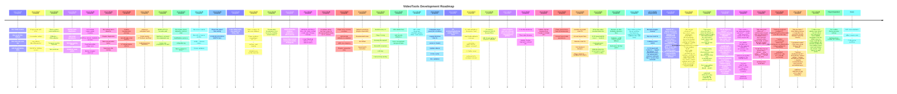

# VideoTools Roadmap

A lightweight forward look. Updated at the start of each dev cycle.

**Interactive board:** open [`roadmap.html`](roadmap.html) in your browser — column-per-module, colour-coded cards, click any card for full details (key files, dependencies, related docs).

```mermaid
timeline
    title VideoTools Development Roadmap
    v0.1.1-dev47 (Shipped) : DLL/ folder rename : Flat exe-dir DLL fallback : Disc info at rip view top : UDF ReadFileData (ISO)
    v0.1.1-dev47 (Shipped) : Progress bar with ETA : ConsoleBox widget : Log refactor (Burn/Rip/Author) : PAL/NTSC full-disc convert
    v0.1.1-dev48 (Shipped) : Theme system (internal/theme/) : PillButton + PillIconButton : Transport controls migrated : Text primitives
    v0.1.1-dev48 (Shipped) : Startup crash diagnostics : i18n script persistence : Windows signing wired : Roadmap visual polish
    v0.1.1-dev48 (Shipped) : Full module button+slider migration : STATUS_STACK_OVERFLOW recovery : Dual before/after player sync : Button straggler clean-up
    v0.1.1-dev49 (Shipped) : Rip module menu bleed fix : Chapter diagnostics : Menu preservation option : Main/extra title naming
    v0.1.1-dev49 (Shipped) : Inuktitut transliteration package : Auto-fill i18n script variants : VT Media Engine refactor
    v0.1.1-dev49 (Shipped) : engine.go subsystem split : Frame pacing PTS-driven overhaul : bwdif deinterlace (libavfilter)
    v0.1.1-dev49 (Shipped) : WaitForPTS for no-audio path : WaitVsync removed from playbackLoop : Frame rate propagation on load
    v0.1.1-dev49 (Shipped) : Rip module layout aligned to Convert style : buildRipBox sections : collapsible log : Open in Player to footer
    v0.1.1-dev49 (Shipped) : Rip source rework : disc info in Source section : single ... browse button : format validation
    v0.1.1-dev49 (Shipped) : Player idle aspect ratio setting : 4:3/16:9/5:3/21:9/9:16 SMPTE bars
    v0.1.1-dev49 (Shipped) : C disc debug utility (hex dump, dir listing, stat)
    v0.1.1-dev49 (Shipped) : Seek corruption fix (accurate fallback) : Player singleton consolidation (10→2) : Verbose seek logging : Media Engine architecture doc
    v0.1.1-dev49 (Shipped) : Thread safety formalisation (lock hierarchy, lockdep, named helpers)
    v0.1.1-dev49 (Shipped) : NoInheritHandles Windows subprocess (file-in-use fix) : Queue.Stop cancels running job (zombie FFmpeg fix)
    v0.1.1-dev49 (Shipped) : Windows Job Object KILL_ON_JOB_CLOSE (crash-safe FFmpeg cleanup) : Linux Pdeathsig SIGKILL on all subprocesses
    v0.1.1-dev49 (Shipped) : Dropdown active item text colour fix (ForegroundOnPrimary on VT_Green)
    v0.1.1-dev50 (Shipped) : Player error recovery overhaul : HW decode default-on evaluation : HDR tone-mapping : Playlist / sequential play
    v0.1.1-dev50 (Shipped) : Network streaming (Engine.OpenURL) : Resume/watch-later : A/V Offset : Speed+pitch correction
    v0.1.1-dev50 (Shipped) : SeekAccuracy UI : Player Tuning : Growing-file support : Clock drift correction : A-B loop : Frame timing overlay
    v0.1.1-dev50 (Shipped) : ASS subtitle fixes : HW decode default-on : Error concealment last-good-frame
    v0.1.1-dev50 (Shipped) : UDF reader robustness (ShortAd, partition offset, multi-extent)
    v0.1.1-dev50 (Shipped) : Collapsible player panel (all 5 modules) : Logging Windows clear fix : version in header : Updater sidecar : CI DLL cache : DLL validation
    v0.1.1-dev51 (Current) : P0 error/loading/buffering overlay indicators wired
    v0.1.1-dev51 (Current) : P2 stub method-set divergence fixed : dead fields/callbacks removed : cosmetic fullscreen/PiP buttons removed : CC button wired : orphaned GPU package removed
    v0.1.1-dev51 (Current) : P1 view.go component split (5 focused files) : UDF thread safety & progress callbacks
    v0.1.1-dev51 (Current) : Legacy singleton alias vars removed (10 per-module vars → GetXxxPlayer() getters)
    v0.1.1-dev52 (Shipped) : CI & infra hardening : Three static binaries : Update checker migrated to GitHub API
    v0.1.1-dev53 (Shipped) : Update checker migrated from Forgejo to GitHub API
    v0.1.1-dev54 (Shipped) : Player performance fixes (6 bottlenecks) : Convert layout state persistence
    v0.1.1-dev55 (Shipped) : seekGen log spam crash fix : Convert layout fixes : Resume crash fix : VLC backend decision : Player minimize → metadata full column
    v0.1.1-dev56 (Shipped) : NTSC/PAL video standard detection : CI FFmpeg build fix (.tar.xz → .tar.bz2) : Content browser build fixes : dvdvideo detection string fixed (CI grep + runtime probe)
    v0.1.1-dev57 (Shipped) : Release cut after dvdvideo detection fixes : dvdvideo→VOB concat runtime fallback : dvdread.pc fail-fast guard
    v0.1.1-dev58 (Shipped) : Rip module overhaul (linear workflow, DiscSummary, Advanced accordion, readiness line, i18n pass)
    v0.1.1-dev59 (Superseded) : Blocked-straggler cleanup : Rip view crash fix : Codeberg mirror retired : CI FFmpeg build resilience — tagged but release never published (release job skipped after windows cold-build flake); content ships as dev60
    v0.1.1-dev60 (Shipped) : Release cut — dev59 content (rip crash fix, Codeberg, cleanup) + CI FFmpeg build resilience (cache restore-keys + download retries). **Published 2026-09-02** (both platform assets); MSIX `Setup static FFmpeg` fixed — missing `export PKG_CONFIG_PATH=/c/ffmpeg-static/lib/pkgconfig` made libdvdnav configure fail on `dvdread`
    v0.1.1-dev61 (Shipped) : **Rip density refinement** — two-column 55/45 workspace (CONTENT | PROCESSING), new ui.SectionBox shared component used by all 8 module helpers (rip + audio/upscale/thumbnail/inspect/compare/filters/trim). **In-app updater fixed** — asset-suffix mismatch (`_windows.zip` vs `_windows_amd64.zip`) had made Install Update always fail; from dev61 onward updates work in-app. Tester screenshots found layout bugs — fixed in dev62
    v0.1.1-dev62 (Shipped) : **Rip layout correction pass** — action-bar Border fix (wrapping-label-in-HBox root cause behind the giant button band, clipped right column, one-char-per-line label) : compact empty states (DiscSummary rows hidden, MenuPreview 40px strip, ContentBrowser centred hint) : first in-app update exercise (dev61→dev62) : published 2026-09-03 (tag v0.1.1-dev62, ccb4f213), all pipelines green
    v0.1.1-dev63 (Shipped) : **dev62 follow-up patches** — Convert/Filters/Upscale metadata-fold fix (tappable METADATA header stays visible, only the body hides) : rip ISO-load scanning-state fix (SetScanning no longer clobbered by rebuildEnrich's SetEmpty) : ISO scan hardening (runISOScan recover→SetError, CatDVD logging, re-scan on module re-entry). **Published 2026-09-04** (tag v0.1.1-dev63, 87a0c6ad)
    v0.1.1-dev64 (Shipped) : **Rip modes + per-language subtitle selection** — mode radio (Selected scenes / Full movie of the longest title) : one subtitle checkbox per main-title language mapped to per-stream -map 0:s:<idx> : scan-as-you-go disc snippets in the DiscSummary : **Convert SMPTE-idle restore** (player reset on menu-driven re-entry) : published 2026-09-06
    v0.1.1-dev65 (Shipped) : **Rip refinement follow-up** — vertical-space layout pass (log demoted to a collapsed strip + menu preview compact until a frame loads, Content Browser regains flexible height) : **Load Disc from an optical drive** (detect → drive picker → VIDEO_TS resolution → normal rip path) : pending tester verification
    v0.1.1-dev66 (Shipped) : **Settings keyboard navigation** (PageUp/PageDown/Home/End scroll the active tab) : **updater error-message hardening** (rate-limit/release-not-published/network causes surfaced in the dialog) : published 2026-09-07 (tag v0.1.1-dev66, ee73323d)
    v0.1.1-dev67 (Shipped) : **Rip de-clutter** (Disc Menu preview + in-app Rip Log removed; Content Browser owns the column) : **rip default mode** ("Full movie (main feature)" first + default) : **settings keyboard-nav fix** (focused key-catcher widget + canvas OnKeyDown fallback — dev66's CustomShortcut never fired for unmodified keys) : published 2026-09-10 (tag v0.1.1-dev67, fc444a78)
    v0.1.1-dev68 (Current) : **VOB-concat subtitle-map clamp** — liar-IFO discs (IFO advertises more subtitle languages than the VOBs carry) no longer hard-fail the concat fallback; the executor probes the real subtitle stream count and clamps per-stream -map indices to what exists
    Player-Dependent : Trim module (frame-accurate cutting) : Enhancement module (AI models)
    Future : DVD menu playback : Video cropping tool : Professional workflow
```

## Legend

| Colour | Meaning |
|--------|---------|
| Blue | Shipped in dev47 |
| Teal | Shipped in dev48 |
| Purple | Shipped in dev49 |
| **Green** | **Current dev64 work** |
| Yellow | Next up (handoff priorities) |
| Orange | Blocked on player completion |
| Red | Future / deferred |

> **Status distinction:** The interactive board (`roadmap.html`) uses 5 statuses:
> `Shipped` → `Done (Untested)` → `In Progress` → `Planned` → `Deferred`.
> "Done" items are complete and committed but not yet verified by a tester.

## Current State (v0.1.1-dev68)

- **Dev68 = VOB-concat subtitle-map clamp** (released as `v0.1.1-dev68`): some discs' IFOs advertise more subtitle languages than the VOBs physically carry subpicture streams for (grey-market media). The dev64 per-stream `-map 0:s:<idx>` flags then reference streams that don't exist and ffmpeg hard-fails the rip on the dvdvideo→VOB-concat fallback (`Stream map '0:s:N' matches no streams`). The executor now probes the concat input's actual subtitle stream count (`probeSubtitleCount`, ffprobe `-select_streams s`, −1 = skip on probe failure) and clamps `SubtitleLangs`/`SubtitleSel` to the leading languages that exist, logging the drop. Verified end-to-end on a real 10-IFO-language/9-stream title.
- **Dev67 shipped/released** (published 2026-09-10, tag `v0.1.1-dev67`, `fc444a78`): tester-requested rip de-clutter — mode radio defaults to/lists first "Full movie (main feature)" and the Disc Menu panel + in-app Rip Log were removed outright so the Content Browser owns the full left-column height (rip activity stays in the on-disk executor log; `menu_preview.go` deleted; obsolete rip i18n keys retired); **settings keyboard-nav fix** — the dev66 `desktop.CustomShortcut` canvas shortcuts were dead (GLFW only synthesizes CustomShortcut when modifier ≠ 0, so bare PageUp/PageDown/Home/End never fired); rewritten to a focused 1×1 key-catcher widget (`settingsKeyNav`, `fyne.Focusable` + `desktop.Keyable`) with canvas `SetOnKeyDown`/`SetOnKeyUp` fallback, keys stop after leaving Settings.
- **Dev66 shipped/released** (published 2026-09-07, tag `v0.1.1-dev66`, `ee73323d`): settings keyboard navigation (visible-tab scroll via `settings.Options.ActiveScroll`, shortcuts registered only while Settings is on screen) + updater error-message hardening (`describeUpdateError` classifies connection/rate-limit/not-yet-published cases). Note: the keyboard navigation was broken for plain keys (`CustomShortcut` needs a modifier in GLFW); fixed in dev67.
- **Dev65 shipped/released** (published 2026-09-07, tag `v0.1.1-dev65`, `acc2bc98`): rip refinement — vertical-space layout pass (Content Browser regains the flexible height; Rip Log demoted to a collapsed-by-default strip with `SetRipLogExpand` auto-open; Disc Menu preview compact until a frame loads) + Load Disc from an optical drive (`OnLoadDisc` → `detectOpticalDrives` + radio drive picker → `VIDEO_TS` resolution → normal load/scan/rip path; `docs/RIP_LOAD_DISC.md`). Tester verification pending.
- **Dev63 shipped** (published 2026-09-04, tag `v0.1.1-dev63`, `87a0c6ad`): dev62 follow-up patches — Convert/Filters/Upscale metadata-fold fix (tappable header stays visible, only the body hides), rip ISO-load scanning-state fix (`SetScanning` after the enrich rebuild), ISO scan hardening (`runISOScan` panic→`SetError`, CatDVD logs, re-scan on module re-entry).
- **Dev62 shipped** (published 2026-09-03, tag `v0.1.1-dev62`, `ccb4f213`, all pipelines green): rip layout correction pass — tester screenshots of dev61 exposed three structural bugs with one root cause (readiness label `TextWrapWord` inside an HBox → giant action-button band, clipped right column, one-char-per-line label). Fixed: action bar = Border, DiscSummary hides empty rows, MenuPreview bounded 40px empty strip, ContentBrowser centred empty-state hint. dev61→dev62 is the first in-app updater exercise.
- **Dev61 shipped**: rip density refinement (two-column 55/45 workspace, `ui.SectionBox` across all 8 module helpers, gaps 10→6px, thumbnails 56×42, menu preview 280×158) + in-app updater asset-suffix fix. Layout bugs found in tester screenshots; corrected in dev62.

- **Dev60 shipped**: dev59 content (rip crash fix, Codeberg retirement, blocked-straggler cleanup) + CI FFmpeg build resilience (cache restore-keys, download retries) released 2026-09-02 with both platform assets; MSIX `Setup static FFmpeg` fixed (`PKG_CONFIG_PATH` export + `pkg-config --exists dvdread` guard).
- **Dev61 = rip density refinement + global header migration**: the dev58 linear vertical rip layout became a two-column 55/45 workspace — LEFT = CONTENT (DiscSummary pinned top, MenuPreview pinned bottom, title list as flexible center), RIGHT = PROCESSING (Format/enrichment, Output as plain bold subsection, Status); SOURCE + action bar span full width. New `ui.SectionBox` shared component (compact 28px teal header, navy body, optional header actions) replaces the per-module `buildXxxBox` duplication across all 8 module helpers (rip + audio/upscale/thumbnail/inspect/compare/filters/trim). Density: gaps 10→6px, thumbnails 80×60→56×42, menu preview 320×180→280×158.
- **In-app updater fixed (dev61)**: `fetchReleaseAssetURL` searched for `_windows.zip`/`_linux.zip` but CI publishes `_windows_amd64.zip`/`_linux_amd64.tar.gz` — Install Update had always failed with "no compatible asset found" (broken since at least dev51; why every update was manual). From dev61 onward in-app updates work. Follow-ups: bake `buildCommit` via ldflags (patch detection dead), Linux tar.gz extraction, stale nightly-PATCH comment.
- **Rip view crash on open fixed** (dev59/dev60): `updateDiscInfo` assigned after the initial `rebuildEnrich()` call → nil-closure panic during first render; now assigned before, plus a `showRipView` recover that logs a stack trace to `crashes.log`.
- **Dev64 gates**: tester verification of the dev64 release (rip mode radio scenes/full-movie, per-language subtitle checkboxes, scan-as-you-go snippets, Convert SMPTE idle after menu-driven re-entry) plus the dev63 content (metadata fold keeps the tappable header visible; ISO load shows "Reading disc information"), the dev62 layout corrections (compact action bar, no stretched buttons, no collapsed labels, compact empty states, right column fully visible at ~1600×900 and 1280×720), the dev61→dev62 in-app update, and the no-scan multi-VOB rip; libVLC Player Backend (Phase 1).
- **Strategic decision: libVLC backend** — replace custom FFmpeg engine with libVLC for user-facing playback. Design doc: `docs/VLC_PLAYER.md`. FFmpeg engine stays as long-term plan.
- Engine-level bwdif deinterlace (libavfilter, Settings toggle default on).
- Player singleton consolidation (10→2 shared instances); per-module getters retained as wrappers.
- Thread safety formalisation (lock hierarchy, lockdep, named helpers).
- Rip module: menu VOB bleed fix, chapter diagnostics, menu preservation, main/extra naming.
- Theme system, PillButton/PillIconButton, text primitives, collapsible section headers — all migrations shipped.
- All 11 Phase 1 items shipped. Phase 2 deferred.

## Now (dev68 — open)

- **Tester verification of dev68 release** — re-run the `Young Harlots - The Academy (2006) DVD5` Main-Feature rip: log shows "dropping N trailing subtitle mapping(s)" and the job completes with the output playable; plus the dev67 content (rip de-clutter, default Full Movie mode, settings keyboard-nav fix) + dev66 content (update-check dialog explains cause) + dev65 content (rip refinement: layout pass + LOAD DISC physical DVD) + the still-pending dev64 release content (rip modes, per-language subtitle checkboxes, scan-as-you-go snippets, Convert SMPTE idle restore) + dev63/dev62/dev61 content; move roadmap cards `rip-overhaul`/`rip-refinement`/`rip-refine-followup` `done` → `shipped` on sign-off
- **Rip mode full-movie path QA** — confirm the "Full movie (main feature)" rip targets the longest title and completes as a single job
- **Tester verification of in-app updater** — a dev61 binary should offer and install dev62/dev64 from Settings (dev61→dev62 was the first exercise; a released dev63 binary → dev64 re-exercises it)
- **libVLC Player Backend (Phase 1)** — PlaybackEngine interface + VLCBackend CGo wrapper; design doc at `docs/VLC_PLAYER.md`
- **Updater hardening** — bake `buildCommit` via ldflags (CI change — ask first), Linux tar.gz extraction path, stale comment cleanup
- Next: dead-code retirement, documentation pass

## Shipped (dev51)

- **GitHub Actions CI green (both platforms)** — Windows build fixed (MSYS2 shell, GOROOT, CC via cygpath, pkg-config with loud failure, crypt32/ncrypt)
- **Windows: three fully static binaries** — static ffmpeg.exe/ffprobe.exe sidecars, DLL/ folder retired, objdump dependency gates in CI (settled decision)
- **v0.1.1-dev51 release published** — first release from the GitHub Actions pipeline
- **P0 indicators wired** — loading spinner, buffering label, error indicator now render over video
- **P2 cleanup** — Stub divergence fixed, dead fields removed, fullscreen/PiP buttons removed, CC button wired to subtitle engine, orphaned GPU package deleted
- **P1 view.go split** — 1442-line monolith → 5 focused files
- **UDF thread safety** — mutex-guarded partitionStart, progress callbacks, deferred cleanup
- **Legacy alias vars removed** — 10 per-module vars cleaned from native_media.go
- **Carry-forward deferred**: Player interface extraction, Burn multi-drive batch, IMAPI2 COM, Main Menu refactor, Linux CI speedup, UDF 2.50/2.60 + BDMV, UDF sparse writer

## Next (Phase 2)

- **Enhancement module** — DEPENDS ON PLAYER
- **Trim module** — DEPENDS ON PLAYER
- **Professional workflow** — Module chaining, batch processing
- **Deferred carry-forward**: Player interface extraction, Burn multi-drive batch, IMAPI2 COM, Main Menu refactor, Linux CI speedup, UDF 2.50/2.60 + BDMV, UDF sparse writer

## Localization

See `docs/localization-policy.md` for the full policy.

- en-CA and fr-CA maintained and complete.
- Inuktitut (syllabics + Latin) machine-generated, needs human review.
- All user-facing strings use `i18n.T().KeyName`.

## Versioning

Continuous global `dev` counter, not reset per public version.

Examples:
- `v0.1.1-dev55`
- `v0.1.4-dev72`

Public releases use the base version only (e.g. `v0.1.2`).

## Public Version Bump Policy

Minimum gate for `v0.1.1-devN` → `v0.1.2`:
- Windows and Linux package workflows green on release candidate.
- Full module smoke test pass per `docs/TESTING_MODULE_CHECKLIST.md`.
- No known P0/P1 regressions in conversion, queue, or subtitle sync.
- Changelog complete and matches release scope.
- Deferred items documented in `TODO.md` with explicit carry-over.
